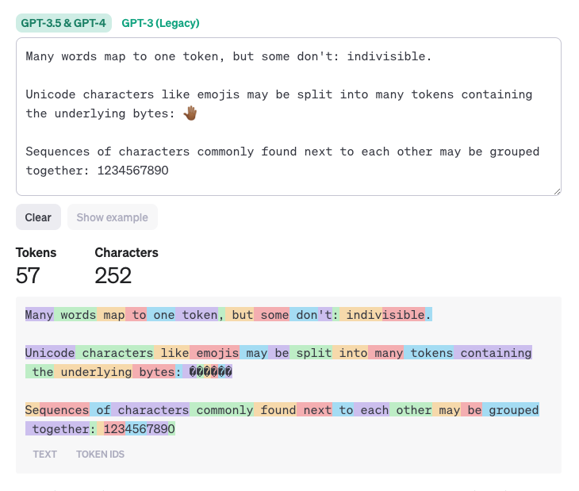

We've mentioned "tokens" a few times in previous lessons, but we didn't explain what those were and why they matter. Let's discuss that now.

## What is Tokenization?

The OpenAI natural language models don't operate on words or characters as units of text, but instead use something in-between: **tokens.** By [definition](https://platform.openai.com/docs/introduction/tokens) tokens are text "chunks" that represent _commonly occuring sequences of characters_ in the large language training dataset.
 - A token can be a single character, fraction of a word, or an entire word. 
 - Many common words are represented by a single token.
 - Less common words are represented by multiple tokens.

**Tokenization** is now the process by which text data (e.g., "prompt") gets _deconstructed_ into a sequence of tokens. The model can then generate the next token in sequence for text 'completion'. We'll see concrete examples of tokenization later in this lesson.

## How are Tokens Used?

Given an input prompt, the natural language models generate completions one token at a time. However, the generated token is not deterministic. At each step, the model outputs a list of all possible tokens with associated weights. The API samples one token from this list, with heavily-weighted tokens more likely to be selected than the others.


It then adds that token to the prompt and repeats the process until the "max token count" limit (context window) is met for the completion - or until the model generates a special "stop token", which halts further token generation. (This [blog post](https://bea.stollnitz.com/blog/how-gpt-works/) by Beatriz Stollnitz explains the process in detail.)

This is how the model generates completions of one or more words, and why those completions can change from invocation to invocation.

## Why Does It Matter?

To understand why tokenization matters, we need to think about two aspects of deployed models: _token limits_ and _token pricing_.

**Token Limits**. Every model has a context window defined as the maximum number of tokens it can process for a single request. For instance, older gpt-3.5-turbo models have a 4K token limit (context) for each request. The token limit is _shared between prompt and completion_. Because the completion gets added to the prompt in order to generate the next token, it becomes necessary to fit both within the total context window for a single request.

**Token Pricing**. Like with any API, model deployment usage incurs costs based on the model type and version. Currently, model pricing is tied to number of tokens used, with different price points possible for each model type or version.

The table below shows the context window (max tokens) and the model pricing (billed in 1K increments) for Azure OpenAI Models. 


Note how newer models like gpt-4-32k have much larger token limits: up to 32,768 tokens. This not only allows for longer completions but also much larger prompts. This is particularly useful for prompt engineering, as we'll see later. 

Keep in mind that usage cost is correspondingly higher. Prompt engineering techniques can also help improve cost efficiency by crafting prompts that minimize token usage costs without sacrficing quality of responses.

## OpenAI Tokenizer Tool

Want to get a better sense of how tokenization works on real text? Use [**OpenAI Tokenizer**](https://platform.openai.com/tokenizer) - a free online tool that visualizes the tokenization and displays the total token count for the given text data.

[🔖 Learn More:](https://help.openai.com/articles/4936856-what-are-tokens-and-how-to-count-them)

### Try The Example

Visit the site and click "show example" to see it in action as shown below. Each color-coded segment represents a single token, with the total token count displayed below (**57 tokens**). 

Note how "1234567890" and "underlying" have the same string lengths - but the former counts for 4 tokens while the latter counts for 1. Also observe how punctuation (":",".") take up 1 token each, cutting into prompt token limits.



### Try The Exercises

:::tip YOUR TURN
Visit [**https://platform.openai.com/tokenizer**](https://platform.openai.com/tokenizer). Clear the tool before each exercise. Enter the exercise text into the Tokenizer and observe the output - it should update interactively.
:::

**Exercise 1:** As a common word, "apple" requires only one token.

```
apple
```

**Exercise 2:**  The word "blueberries" requires two tokens: "blue" and "berries".

```
blueberries
```

**Exercise 3:** Proper names generally require multiple tokens (unless common) 

```
Skarsgård
```

It's this token representation that allows AI models to generate words that are not in any dictionary, but without having to generate text on a letter-by-letter basis (which could easily result in gibberish). 

**Build your intuition by trying out other words or phrases.**
